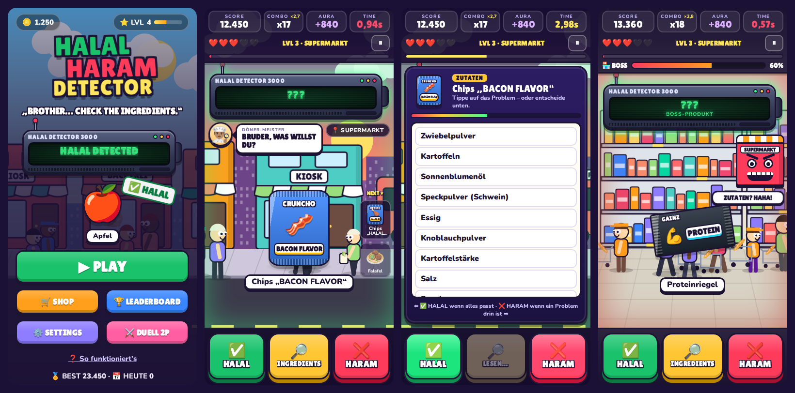

# 🔎 HALAL HARAM DETECTOR

> **„BROTHER… CHECK THE INGREDIENTS.“**

Ein absurd schnelles, chaotisches Meme-Reaktionsspiel für Handy und Browser. Du läufst mit dem völlig übertriebenen **HALAL-HARAM-DETECTOR 3000** durch eine Cartoon-Stadt und musst bei jedem Produkt blitzschnell entscheiden:

| ✅ HALAL | 🔎 INGREDIENTS | ❌ HARAM |
|---|---|---|
| Obst, Gemüse, Wasser, Grundnahrungsmittel oder sichtbares „HALAL ✓“-Siegel | Alles Unklare: Gummibärchen, Soßen, Fertiggerichte, Fleisch ohne Siegel … | Eindeutig Schwein oder Alkohol als Getränk |

**Einfach zu verstehen. Schwer zu meistern. Komplett chaotisch.**



## ▶ Spielen

Keine Installation, keine Abhängigkeiten, kein Build-Schritt:

- **Direkt:** `index.html` im Browser öffnen (Doppelklick genügt).
- **Mit lokalem Server** (empfohlen, dann läuft es auch offline als App):
  ```bash
  python3 -m http.server 8000
  # dann http://localhost:8000 öffnen
  ```
- **Online stellen:** Den Ordner auf einen beliebigen statischen Host legen (z. B. GitHub Pages: *Settings → Pages → Deploy from branch*). Über HTTPS ist das Spiel eine installierbare PWA („Zum Startbildschirm hinzufügen“) und funktioniert danach auch offline.

### Steuerung

| Aktion | Touch | Tastatur |
|---|---|---|
| HALAL | 🟢 linker Button | `←` oder `A` |
| INGREDIENTS | 🟡 mittlerer Button | `↓`, `S` oder `Leertaste` |
| HARAM | 🔴 rechter Button | `→` oder `D` |
| Problem-Zutat melden | Zutat in der Liste antippen | – |
| Pause | ⏸ | `Esc` / `P` |

Optional in den Settings: **Swipe-Steuerung** (links = HALAL, tippen = INGREDIENTS, rechts = HARAM).
**Duell (2 Spieler, ein Gerät):** Spieler 1 `A` `S` `D`, Spieler 2 `J` `K` `L` (oder Pfeiltasten). Auf dem Handy sitzen beide gegenüber.

## 🎮 Features

- **Kern-Loop:** Produkt erscheint → Detector piept und scannt (`BEEP` → `SCANNING...` → `???`) → du entscheidest gegen die Uhr → sofortiges Feedback → nächstes Produkt, immer schneller.
- **Zutaten-Minispiel:** Verpackung zoomt heran, die Zutatenliste scrollt vorbei. Problem-Zutat antippen (z. B. *Gelatine (Schwein)*, *Rum*) oder HALAL/HARAM entscheiden. Später werden die Listen länger und das Problem versteckt sich weiter unten. Fallen wie *Zuckeralkohol* (ist kein Alkohol) oder *Cocktailsoße (ohne Alkohol)* inklusive.
- **114 Produkte + Legendary Items** mit Lookalikes: `HALAL CHICKEN` direkt neben `BACON FLAVOR`, `HALLO` statt `HALAL`, Cola vs. Dosenbier in derselben Dose, Falafel vs. Frikadelle, Weingummi, Schweineohr (das Gebäck!), Leberkäse …
- **7 Level, 7 Stadtbereiche:** Straße → Dönerladen → Supermarkt → Einkaufszentrum → Flughafen → Nachtmarkt → Mega Food City. Ab Level 4 mehrere Produkte gleichzeitig („NEXT“-Warteschlange), ab Level 5 unter einer Sekunde, Level 7 = *DETECTOR APOCALYPSE* (NPCs reden durcheinander, Pakete fliegen durchs Bild, der Detector überhitzt).
- **Boss „DER SUPERMARKT“:** Der Supermarkt wird zum Gegner, Produkte fliegen von links und rechts herein. Richtig −10 % Boss-HP, falsch +5 %. Danach: `SUPERMARKET CLEARED` → `HALAL DETECTOR LEVEL UP`.
- **Combo & Aura:** `HALAL STREAK 🔥` (5) … `BROTHER HAS ASCENDED` (20) … `DETECTOR OVERCLOCKED` (50) … `CITY SCAN ACTIVATED` (75) … bei **100** zoomt die Kamera heraus und der Detector scannt die ganze Stadt: *„BROTHER HAS BECOME THE DETECTOR.“* Aura gibt’s für schnelle Scans, gefundene Zutaten und perfekte Level. Abzug gibt’s für Raten, Zögern und 3 Fehler in Folge (`-900 AURA 💀`).
- **Seltene Events:** Mystery Box, Grandma Mode („ICH HABE DAS SELBST GEMACHT.“), Ingredients in Arabic (mit Übersetzung), „BROTHER TRUST ME“ (Trust Level: 0 %), **Döner mit 17 Soßen** (`SYSTEM OVERLOAD`), Tauben-Diebstahl und ein sehr unnötiges Detector-Update.
- **Zufällige Störungen:** Busse, Passanten, Verkäufer-Hände, umgedrehte oder nur halb sichtbare Verpackungen.
- **Tutorial** mit dem Döner-Meister („WHAT IS THIS?“ → „NOW DON’T GUESS.“ → „WHEN YOU DON’T KNOW, CHECK.“).
- **Shop mit 7 Detector-Skins:** Default, Gold (5000), Neon (Cyber), Döner Edition, Banana Edition, Grandma Edition (Teppichklopfer) und das Ultra Rare *THE FORBIDDEN SCANNER* (nur durch Combo 75).
- **Progression:** XP schalten Stadtbereiche frei, Coins kaufen Skins, lokale Ranglisten (Score, Combo, schnellste Reaktion, meiste richtige Entscheidungen, Aura, schnellster Zutaten-Check), persönliche Bestleistung und Tagesrekord.
- **Sound & Musik komplett synthetisiert** (Web Audio, keine Audiodateien): Scanner-Beeps, Fehler-Sounds, Bass-Meme-Boom, Crowd-Reaktionen, Döner-Grill und Supermarkt-Durchsagen. Der Beat wird mit Level und Combo schneller, im Bossfight dramatisch und in den letzten Millisekunden hektisch.
- **Barrierefreiheit:** reduzierte Animationen (respektiert auch die System-Einstellung), reduzierte Bildschirm-Effekte, größere Buttons, Lautstärke, Musik/Sounds getrennt schaltbar, zusätzliche Muster auf den Buttons. Farbe ist nie das einzige Signal (Symbol + Text + feste Position).
- **Performance:** Vanilla JS ohne Framework. Die Stadt wird auf einem Canvas mit vorgerenderten Sprites gezeichnet (unter 1 ms pro Frame), Partikel und Produkt-Elemente werden aus Pools wiederverwendet. Mobile-first.

## ⚖️ Wichtige Designregel

Das Spiel ist **Unterhaltung und kein religiöses Rechtsgutachten.** Der Humor richtet sich auf den völlig überforderten Detector, nicht auf eine Religion oder auf Menschen.

- Eindeutige Antworten gibt es nur, wenn das Spiel selbst die Information liefert: offensichtliches Produkt, sichtbares „HALAL ✓“-Siegel oder die angezeigte Zutatenliste.
- Alles Unklare führt bewusst zu **INGREDIENTS 🔎**. Raten wird bestraft, auch wenn es zufällig richtig war.
- Strittige Sonderfälle (z. B. Lab im Käse, bestimmte Essigsorten, Spuren-Alkohol in Aromen, Meeresfrüchte) kommen bewusst nicht als Entscheidung vor.
- Im echten Leben gilt: echte Zutatenliste lesen und bei Unsicherheit fachkundige Stellen fragen.

## 🗂️ Projektstruktur

```
index.html            Alle Screens (Start, Stadtkarte, Spiel, Game Over, Shop, Rangliste, Settings, Hilfe, Duell)
css/style.css         Cartoon-/Cel-Shading-Look, Verpackungs-Art, Detector-Skins, Animationen
js/util.js            Kleine Helfer
js/data.js            Spielinhalte: Produkte, Zutaten-Varianten, Level, Bereiche, NPCs, Sprüche, Skins
js/store.js           Lokale Speicherung (localStorage): Fortschritt, Rekorde, Ranglisten, Settings
js/audio.js           Synthetisierte Soundeffekte, Musik-Sequencer, Ambience
js/art.js             Produkt-, Detector- und NPC-Markup
js/world.js           Lebendige Stadt im Hintergrund (Canvas): Läden, Passanten, Busse, Stadtscan
js/fx.js              Partikel, schwebende Texte, Flash, Screenshake, Banner, Toasts
js/game.js            Gameplay-Kern: Timer, Entscheidungen, Minispiel, Combo, Aura, Boss, Events, Tutorial
js/duel.js            Lokaler 2-Spieler-Modus
js/ui.js              Menüs, Shop, Rangliste, Settings, Eingabe (Touch, Tastatur, Swipe)
js/main.js            Start & Haupt-Loop
sw.js                 Service Worker (offline spielbar)
manifest.webmanifest  PWA-Manifest
assets/               Icons & Schriften
```

## 📜 Credits

- Schriften: [Lilita One](https://fonts.google.com/specimen/Lilita+One) und [Nunito](https://fonts.google.com/specimen/Nunito), beide unter der SIL Open Font License (siehe `assets/fonts/`), lokal eingebunden (keine Anfragen an Google).
- Emojis kommen aus dem System des Geräts.
