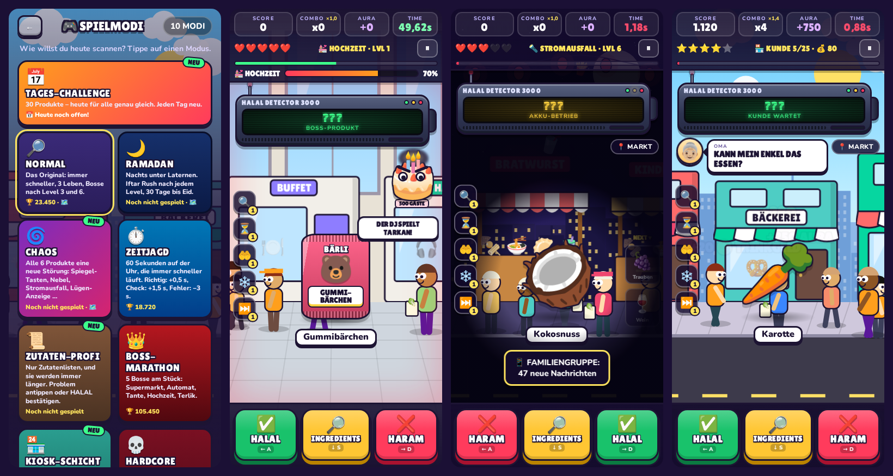
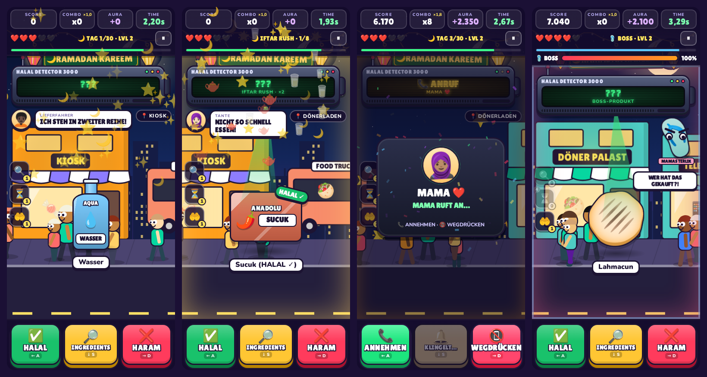

# 🔎 HALAL HARAM DETECTOR

> **„BROTHER… CHECK THE INGREDIENTS.“**

Ein absurd schnelles, chaotisches Meme-Reaktionsspiel für Handy und Browser. Du läufst mit dem völlig übertriebenen **HALAL-HARAM-DETECTOR 3000** durch eine Cartoon-Stadt und musst bei jedem Produkt blitzschnell entscheiden:

| ✅ HALAL | 🔎 INGREDIENTS | ❌ HARAM |
|---|---|---|
| Obst, Gemüse, Wasser, Grundnahrungsmittel oder sichtbares „HALAL ✓“-Siegel | Alles Unklare: Gummibärchen, Soßen, Fertiggerichte, Fleisch ohne Siegel … | Eindeutig Schwein oder Alkohol als Getränk |

**Einfach zu verstehen. Schwer zu meistern. Komplett chaotisch.** Seit **Version 2.0** mit Ramadan-Modus, Iftar Rush, Mama am Telefon und einem fliegenden Terlik. Seit **Version 3.0** mit **10 Spielmodi**, fünf Bossen und 183 Produkten.


## ▶ Spielen

Keine Installation, keine Abhängigkeiten, kein Build-Schritt:

- **Direkt:** `index.html` im Browser öffnen (Doppelklick genügt).
- **Mit lokalem Server** (empfohlen, dann läuft es auch offline als App):
  ```bash
  python3 -m http.server 8000
  # dann http://localhost:8000 öffnen
  ```
- **Online stellen:** Den Ordner auf einen beliebigen statischen Host legen (z. B. GitHub Pages: *Settings → Pages → Deploy from branch*). Über HTTPS ist das Spiel eine installierbare PWA („Zum Startbildschirm hinzufügen“) und funktioniert danach auch offline.

### Steuerung

| Aktion | Touch | Tastatur |
|---|---|---|
| HALAL | 🟢 linker Button | `←` oder `A` |
| INGREDIENTS | 🟡 mittlerer Button | `↓`, `S` oder `Leertaste` |
| HARAM | 🔴 rechter Button | `→` oder `D` |
| Problem-Zutat melden | Zutat in der Liste antippen | – |
| Power-ups (Röntgen · Zeitlupe · Dua · Eiszeit · Joker) | 🔍 ⏳ 🤲 ❄️ ⏭️ am linken Rand | `1` bis `5` |
| Mama-Anruf annehmen / wegdrücken | 📞 grüner / 📵 roter Button | wie HALAL / HARAM |
| Pause | ⏸ | `Esc` / `P` |

Optional in den Settings: **Swipe-Steuerung** (links = HALAL, tippen = INGREDIENTS, rechts = HARAM).
Die Tasten wirken nach **Position** (links, Mitte, rechts): Vertauscht der Chaos-Modus die Buttons, wandern die Tasten mit.
**Duell (2 Spieler, ein Gerät):** Spieler 1 `A` `S` `D`, Spieler 2 `J` `K` `L` (oder Pfeiltasten). Auf dem Handy sitzen beide gegenüber.

## 🎮 Features

- **Kern-Loop:** Produkt erscheint → Detector piept und scannt (`BEEP` → `SCANNING...` → `???`) → du entscheidest gegen die Uhr → sofortiges Feedback → nächstes Produkt, immer schneller.
- **Zutaten-Minispiel:** Verpackung zoomt heran, die Zutatenliste scrollt vorbei. Problem-Zutat antippen (z. B. *Gelatine (Schwein)*, *Rum*) oder HALAL/HARAM entscheiden. Später werden die Listen länger und das Problem versteckt sich weiter unten. Fallen wie *Zuckeralkohol* (ist kein Alkohol) oder *Cocktailsoße (ohne Alkohol)* inklusive.
- **183 Produkte + 5 Legendary Items** mit Lookalikes: `HALAL CHICKEN` direkt neben `BACON FLAVOR`, `HALLO` statt `HALAL`, Cola vs. Dosenbier in derselben Dose, Falafel vs. Frikadelle, Weingummi, Schweineohr (das Gebäck!), Leberkäse …
- **7 Level, 7 Stadtbereiche:** Straße → Dönerladen → Supermarkt → Einkaufszentrum → Flughafen → Nachtmarkt → Mega Food City. Ab Level 4 mehrere Produkte gleichzeitig („NEXT“-Warteschlange), ab Level 5 unter einer Sekunde, Level 7 = *DETECTOR APOCALYPSE* (NPCs reden durcheinander, Pakete fliegen durchs Bild, der Detector überhitzt).
- **Boss „DER SUPERMARKT“:** Der Supermarkt wird zum Gegner, Produkte fliegen von links und rechts herein. Richtig −10 % Boss-HP, falsch +5 %. Danach: `SUPERMARKET CLEARED` → `HALAL DETECTOR LEVEL UP`.
- **Combo & Aura:** `HALAL STREAK 🔥` (5) … `BROTHER HAS ASCENDED` (20) … `DETECTOR OVERCLOCKED` (50) … `CITY SCAN ACTIVATED` (75) … bei **100** zoomt die Kamera heraus und der Detector scannt die ganze Stadt: *„BROTHER HAS BECOME THE DETECTOR.“* Aura gibt’s für schnelle Scans, gefundene Zutaten und perfekte Level. Abzug gibt’s für Raten, Zögern und 3 Fehler in Folge (`-900 AURA 💀`).
- **Seltene Events:** Mystery Box, Grandma Mode („ICH HABE DAS SELBST GEMACHT.“), Ingredients in Arabic (mit Übersetzung), „BROTHER TRUST ME“ (Trust Level: 0 %), **Döner mit 17 Soßen** (`SYSTEM OVERLOAD`), Tauben-Diebstahl und ein sehr unnötiges Detector-Update.
- **Zufällige Störungen:** Busse, Passanten, Verkäufer-Hände, umgedrehte oder nur halb sichtbare Verpackungen.
- **Tutorial** mit dem Döner-Meister („WHAT IS THIS?“ → „NOW DON’T GUESS.“ → „WHEN YOU DON’T KNOW, CHECK.“).
- **Shop mit 16 Detector-Skins und 5 Power-ups:** Default, Gold (5000), Neon (Cyber), Döner Edition, Banana Edition, Grandma Edition (Teppichklopfer), das Ultra Rare *THE FORBIDDEN SCANNER* (nur durch Combo 75) und die neuen Skins aus 2.0 und 3.0.
- **Progression:** XP schalten Stadtbereiche frei, Coins kaufen Skins, lokale Ranglisten (Score, Combo, schnellste Reaktion, meiste richtige Entscheidungen, Aura, schnellster Zutaten-Check), persönliche Bestleistung und Tagesrekord.
- **🗣️ Detector-Stimme:** Nach jeder Entscheidung sagt der Detector laut, was das Produkt wirklich ist: **„HALAL“** oder **„HARAM“**. Bei Zutaten-Produkten sagt er es erst, wenn die Zutaten aufgedeckt sind; wer nie nachschaut, erfährt es auch nicht. Es gibt drei Tonlagen: normal, dramatisch mit Hall bei Fehlern und Hype ab Combo 10. In Level 7 stottert der überhitzte Detector („HA-HA-HALAL“), und jeder Skin klingt etwas anders. Während er spricht, wird die Musik leiser. Die Stimme läuft auch im Tutorial und im Duell und lässt sich in den Settings und im Pause-Menü abschalten.
- **Sound & Musik komplett synthetisiert** (Web Audio, bis auf die Stimme keine Audiodateien): Scanner-Beeps, Fehler-Sounds, Bass-Meme-Boom, Crowd-Reaktionen, Döner-Grill und Supermarkt-Durchsagen. Der Beat wird mit Level und Combo schneller, im Bossfight dramatisch und in den letzten Millisekunden hektisch.
- **Barrierefreiheit:** reduzierte Animationen (respektiert auch die System-Einstellung), reduzierte Bildschirm-Effekte, größere Buttons, Lautstärke, Musik/Sounds getrennt schaltbar, zusätzliche Muster auf den Buttons. Farbe ist nie das einzige Signal (Symbol + Text + feste Position).
- **Performance:** Vanilla JS ohne Framework. Die Stadt wird auf einem Canvas mit vorgerenderten Sprites gezeichnet (unter 1 ms pro Frame), Partikel und Produkt-Elemente werden aus Pools wiederverwendet. Mobile-first.

## 🎮 Neu in Version 3.0 – „Mehr von allem“



- **Neue Modus-Auswahl** mit 10 Modi, Bestwert je Modus und „NEU“-Markierung. Modi mit 🗺️ starten über die Stadtkarte, die anderen sofort.
  - 📅 **Tages-Challenge:** 30 Produkte, die heute für alle genau gleich sind (fester Zufall aus dem Datum). Jeden Tag neu, mit eigenem Tagesbestwert.
  - ⏱️ **Zeitjagd:** 60 Sekunden auf der Uhr, die mit jedem Level schneller läuft. Richtig gibt +0,5 s, ein Zutaten-Check +1,5 s, ein Fehler kostet −3 s. Bei 10 Sekunden warnt der Detector.
  - 🌀 **Chaos:** Alle 6 Produkte kommt eine neue Störung, und der Schauplatz wechselt mit. Es gibt 13 Störungen:
    - 🪞 Spiegel (HALAL und HARAM tauschen die Plätze)
    - 🔀 Mischmasch (die Tasten mischen sich bei jedem Produkt)
    - 🌫️ Nebel, 🔬 Mini, 🎠 Karussell, 🙃 Kopfstand
    - 🙈 ohne Namen, 📝 nur Text
    - ⚡ Turbo, 🐌 Gemütlich, 💰 Doppelt
    - 🔦 Stromausfall
    - 🤥 Lügen-Anzeige: das Display rät, die Stimme bleibt ehrlich
  - 📜 **Zutaten-Profi:** nur Zutatenlisten, die sofort aufgehen und immer länger werden.
  - 👑 **Boss-Marathon:** alle 5 Bosse am Stück, jeder in seiner eigenen Kulisse. Wer alle schafft, schaltet die *Hochzeits Edition* frei.
  - 🏪 **Kiosk-Schicht:** 25 Kunden fragen „Ist das halal?“. Du hast 5 Sterne Bewertung, schnelle Antworten bringen Trinkgeld, und am Ende gibt es eine Kundenbewertung. Mit 5 Sternen wird die *Kiosk Edition* freigeschaltet.
- **Drei neue Bosse:**
  - 🎰 **Der Snack-Automat:** „KEIN WECHSELGELD!“
  - 🧕🏻 **Die Tante:** „WANN HEIRATEST DU?“
  - 🎂 **Die Hochzeit:** „500 GÄSTE. 1 DETECTOR.“, im eigenen Hochzeitssaal mit Buffet und DJ Habibi

  In Level 7 kommen jetzt alle fünf Bosse abwechselnd.
- **48 neue Produkte**, darunter:
  - Doppelgänger wie Glühwein vs. Kinderpunsch, Mojito vs. Virgin Mojito, Kräuterlikör vs. Kräutertee und Döner vs. Gyros
  - Schokoküsse, Wackelpudding, Marzipan, Vitamin-Gummis, Maultaschen, Kaiserschmarrn, Hochzeitstorte, Mettbrötchen und Weißwurst
  - Eiswürfel („Der Detector ist beleidigt“) und Salz
  - zwei neue Legendary Items: Goldenes Simit und Platin-Ayran
  - neue Orte: Weihnachtsmarkt, Hochzeit und Späti
- **Neue Figuren:** Opa, kleine Schwester, Cousin („Ich hab da einen Guy“), Hochzeitsgast, Student und der Kiosk-Chef.
- **Neue Überraschungen:**
  - 🔦 Stromausfall (nur die Taschenlampe leuchtet)
  - ⚡ Blitzangebot (5 Produkte zählen doppelt)
  - 🚗 Hochzeitskorso (düt düt düüüt)
  - 🐈 die Kiosk-Katze setzt sich vors Produkt
  - 📱 Sprachnachrichten vom Onkel
- **Neue Power-ups:** ❄️ *Eiszeit* hält die Zeit an. ⏭️ *Joker* überspringt ein Produkt ohne Strafe, die Combo bleibt.
- **Der Detector spricht mehr:** „Neues Level!“, „Achtung, Boss!“, „Boss besiegt!“, „Neue Störung!“, „Noch zehn Sekunden!“, „Feierabend!“ und „Geschafft!“. Die Sätze warten, bis ein laufendes „HALAL“/„HARAM“ fertig ist.
- **Mehr Fortschritt:**
  - 32 Erfolge (unter anderem *Uhrmacher*, *Chaos-Bändiger*, *Tanten-Diplomat*, *Allrounder* für alle 10 Modi)
  - 22 Tagesaufgaben im Pool
  - neue Ränge bis *Legende vom Kiosk*
  - Ranglisten-Bereich „Bestwerte je Modus“
  - vier neue Skins: Simit, Pixel (8-Bit), Kiosk, Hochzeit
- Mehr Sprüche für alle Situationen und neue Sounds: Ladenklingel, Kasse, Hupkonzert, Davul & Zurna und Automaten-Klonk.

## 🌙 Neu in Version 2.0



- **4 Spielmodi** (Auswahl auf der Stadtkarte):
  - 🔎 **Normal**: das Original.
  - 🌙 **Ramadan**: Die Stadt wird nachts gespielt, mit Laternen-Girlanden, Mondsichel und „RAMADAN KAREEM“-Schild. Die Familie läuft durchs Bild und Iftar-Gerichte tauchen öfter auf. Alle drei richtigen Entscheidungen vergeht ein Tag. An **Tag 30 ist Eid**: Bayram-Geld (+500 🪙), der Sultan-Skin und ab dann ×1,5 Punkte.
  - 💀 **Hardcore**: ein Leben, doppelte Punkte.
  - 🧘 **Üben**: keine Zeit, keine Leben, keine Rangliste. Gedacht zum Lernen.
- **Iftar Rush 🌙**: Plötzlich (im Ramadan-Modus nach jedem Level) kommen 8 Iftar-Gerichte im Sprint, mit doppelten Punkten und Emoji-Regen. Ein fehlerfreier Rush bringt +500 Aura und ein Power-up.
- **Mama ruft an 📞**: Mitten im Scan klingelt das Handy. Annehmen bringt +150 Aura. Wegdrücken kostet −300 Aura, und **Mamas Terlik** kommt geflogen (*KLATSCH!*, mit Riss im Bildschirm). Auch drei Fehler in Folge lösen den Terlik aus.
- **Halal-Polizei 🚨**: Ein selbsternannter Experte ruft bei eindeutig halalen Produkten laut „HARAM!!“ („HAB ICH AUF TIKTOK GESEHEN“). Wer selbst denkt, bekommt einen Bonus.
- **Zweiter Boss „MAMAS TERLIK“** in Level 6. In Level 7 kommt alle 25 Produkte ein neuer Boss.
- **Power-ups**: 🔍 *Röntgen-Blick* (zeigt die Antwort bzw. die Problem-Zutat), ⏳ *Zeitlupe* (6 Produkte mit fast doppelter Zeit), 🤲 *Mamas Dua* (der nächste Fehler kostet kein Leben). Sie sind im Shop kaufbar und kommen als Belohnung bei Combo 15/40/60 und für einen perfekten Rush.
- **135 Produkte + 3 Legendary**. Neu dabei sind unter anderem Mercimek, Simit, Çay, Sütlaç, Sarma (vs. Wein), Rosensirup, Baklava, Börek, Lahmacun, Pide, Köfte, Mantı, Gözleme, Lokum, Samosa, Sucuk ohne Siegel, ein ganzes Iftar-Buffet und Rakı. Bei Oma kocht jetzt auch mal Mama („MAMAS TUPPERDOSE“) oder die Tante.
- **Neue Figuren**: Mama 🧕🏽, Tante 🧕🏻, Onkel 🧔🏽‍♂️, der kleine Bruder und die Halal-Polizei, dazu jede Menge neuer Sprüche („MASHALLAH, GROSS GEWORDEN!“, „DU BIST SO DÜNN GEWORDEN!“, „WALLAH, ES IST HALAL, AKHI.“).
- **Neue Combo-Stufen**: `MASHALLAH! 🌙` (15), `YALLAH YALLAH YALLAH` (25), `SULTAN DES SCANNENS 👑` (40), `SUBHANALLAH` (60) … bis 100.
- **Meta-Fortschritt**:
  - 📅 **3 Tagesaufgaben** (jeden Tag neu, gleich für alle)
  - 🏅 **Erfolge** (von *BISMILLAH* bis *THE DETECTOR SEES EVERYTHING*)
  - 📖 **Lexikon** mit allen Produkten (seit 3.0: 192 Einträge) und Erklärungen
  - ⭐ **Ränge** von *MINI-AKHI* über *HABIBI* und *DÖNER-PASCHA* bis *DETECTOR-SULTAN*
  - 🎁 täglicher **Harçlık vom Onkel** (+50 🪙)
- **5 neue Detector-Skins**: Dattel Edition, Ramadan Edition (Hilal Scanner), Çay Edition (Çay-o-Mat 3000), Terlik Edition und die Sultan Edition (nur durch Eid).
- **Orient-Musik**: Darbuka im Maqsum-Rhythmus, Hijaz-Melodie und ein Bordun, alles synthetisiert. Dazu kommen eine Ramadan-Ambience mit klirrenden Teegläsern und neue Sounds (Klingelton, Terlik-Klatscher, Polizei-Sirene, Mashallah-Chor, Eid-Fanfare). Der Musikstil ist in den Settings wählbar (Auto / Orient / Arcade).

## ⚖️ Wichtige Designregel

Das Spiel ist **Unterhaltung und kein religiöses Rechtsgutachten.** Der Humor richtet sich auf den völlig überforderten Detector und auf Alltagssituationen, die viele aus der eigenen Familie kennen (Mama am Telefon, die Tante mit dem Börek, der Onkel mit dem Harçlık). Er richtet sich nicht gegen eine Religion oder gegen Menschen. Glaubensinhalte wie Gott, Prophet, Koran oder Gebet sind bewusst nie Gegenstand von Witzen.

- Eindeutige Antworten gibt es nur, wenn das Spiel selbst die Information liefert: offensichtliches Produkt, sichtbares „HALAL ✓“-Siegel oder die angezeigte Zutatenliste.
- Alles Unklare führt bewusst zu **INGREDIENTS 🔎**. Raten wird bestraft, auch wenn es zufällig richtig war.
- Strittige Sonderfälle (z. B. Lab im Käse, bestimmte Essigsorten, Spuren-Alkohol in Aromen, Meeresfrüchte) kommen bewusst nicht als Entscheidung vor.
- Im echten Leben gilt: echte Zutatenliste lesen und bei Unsicherheit fachkundige Stellen fragen.

## 🗂️ Projektstruktur

```
index.html            Alle Screens (Start, Spielmodi, Stadtkarte, Spiel, Game Over, Shop, Lexikon, Aufgaben, Rangliste, Settings, Hilfe, Duell)
css/style.css         Cartoon-/Cel-Shading-Look, Verpackungs-Art, Detector-Skins, Animationen
js/util.js            Kleine Helfer
js/data.js            Spielinhalte: Produkte, Zutaten-Varianten, Level, Bereiche, NPCs, Sprüche, Skins
js/data2.js           Inhalte 2.0: Iftar-Gerichte, Familie, Halal-Polizei, Modi, Power-ups, Aufgaben, Erfolge, Ränge
js/data3.js           Inhalte 3.0: 6 neue Modi, Chaos-Störungen, Boss-Registry, 48 Produkte, Figuren, Events, Skins
js/meta.js            Tagesaufgaben, Erfolge, Lexikon, Ränge, Tagesbonus
js/store.js           Lokale Speicherung (localStorage): Fortschritt, Rekorde, Ranglisten, Settings
js/voicedata.js       Detector-Stimme: „HALAL“ / „HARAM“ in 3 Tonlagen + 10 kurze Sätze (kleine MP3s, eingebettet – erzeugt mit tools/make-voice.sh)
js/audio.js           Synthetisierte Soundeffekte, Musik-Sequencer, Ambience, Detector-Stimme
js/art.js             Produkt-, Detector- und NPC-Markup
js/world.js           Lebendige Stadt im Hintergrund (Canvas): Läden, Passanten, Busse, Stadtscan, Ramadan-Nacht
js/fx.js              Partikel, schwebende Texte, Flash, Screenshake, Banner, Toasts
js/game.js            Gameplay-Kern: Timer, Entscheidungen, Minispiel, Combo, Aura, Bosse, Events, Modi, Iftar Rush, Anrufe, Power-ups, Tutorial
js/duel.js            Lokaler 2-Spieler-Modus
js/ui.js              Menüs, Shop, Lexikon, Aufgaben, Rangliste, Settings, Eingabe (Touch, Tastatur, Swipe)
js/main.js            Start & Haupt-Loop
sw.js                 Service Worker (offline spielbar)
manifest.webmanifest  PWA-Manifest
assets/               Icons & Schriften
tools/make-voice.sh   Erzeugt js/voicedata.js neu (SVOX Pico + SoX + LAME)
```

## 📜 Credits

- Schriften: [Lilita One](https://fonts.google.com/specimen/Lilita+One) und [Nunito](https://fonts.google.com/specimen/Nunito), beide unter der SIL Open Font License (siehe `assets/fonts/`), lokal eingebunden (keine Anfragen an Google).
- Detector-Stimme: erzeugt mit der Sprachsynthese [SVOX Pico](https://android.googlesource.com/platform/external/svox/) (Apache License 2.0), geschnitten mit SoX, kodiert mit LAME. Neu erzeugen mit `bash tools/make-voice.sh` (benötigt `libttspico-utils`, `sox`, `lame`).
- Emojis kommen aus dem System des Geräts.
